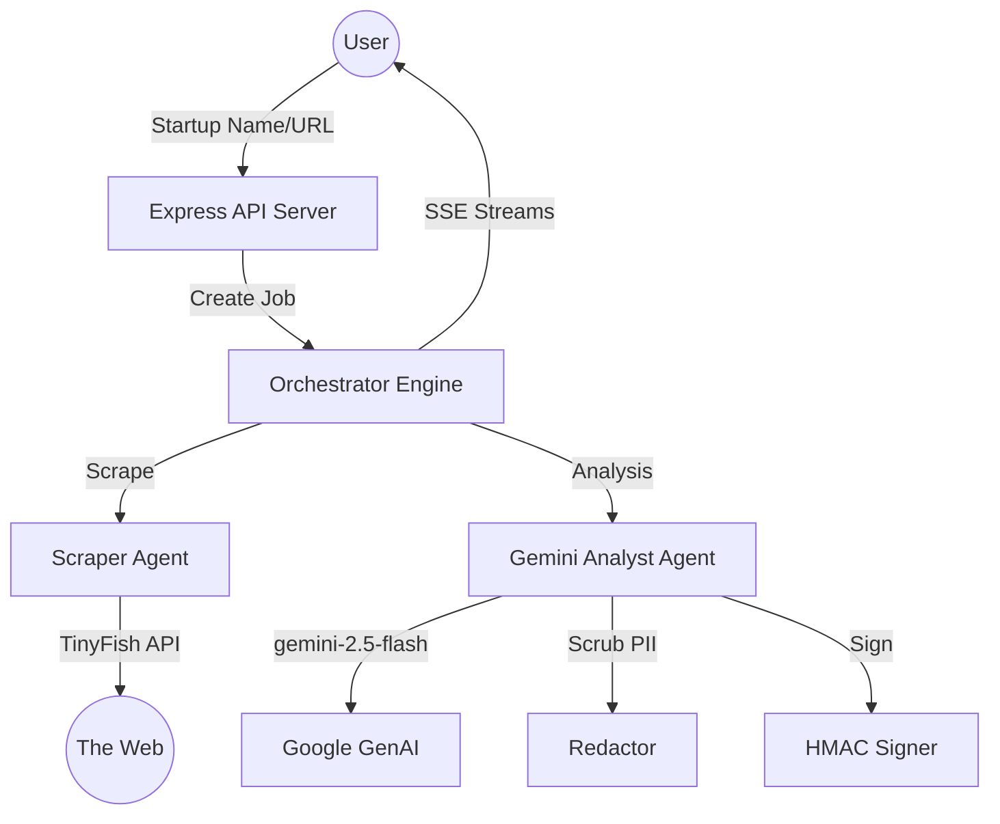

# 🐟 tinyFish - AI VC Research Analyst

**tinyFish** is a high-performance, automated due diligence engine designed to analyze startups, verify claims, and generate data-dense venture research reports.

[**Architecture Docs**](./docs/ARCHITECTURE.md) | [**UI Design Guide**](./docs/UI_GUIDE.md)

---

## 🚀 Key Features

- **Automated Pipeline**: End-to-end research flows from URL/Startup Name to final PDF-ready report.
- **Gemini 2.5 Intelligence**: Leveraging `gemini-2.5-flash` for deep technical and market analysis.
- **Signal Verification**: Cross-references claims across GitHub, Twitter, LinkedIn, and more.
- **Premium UI/UX**: Data-dense "Vercel-meets-Bloomberg" dashboard with dark theme and real-time SSE progress streaming.
- **Security First**: 
  - **PII Scrubbing**: Automatic redaction of emails, phones, and addresses.
  - **Report Integrity**: HMAC-SHA256 signature verification for every generated report.
  - **Budget Checks**: Built-in token budget and rate-limiting guards.

---

## 🏗 Architecture



---

## 🛠 Tech Stack

- **Frontend**: React 19, Vite 8, Tailwind CSS (Foundational), Vanilla CSS (Premium styling).
- **Backend**: Node.js, Express 5, TypeScript 5.
- **AI**: `@google/genai` (Gemini SDK).
- **Tooling**: Vitest (Testing), PostCSS (Styling).
- **Storage**: In-memory job state (Production-ready for Redis integration).

---

## 📥 Getting Started

### 1. Prerequisites
- Node.js 20+
- Google Gemini API Key

### 2. Installation
```bash
git clone https://github.com/user/tinyFish.git
cd tinyFish
npm install
```

### 3. Environment Setup
Create a `.env` file in the root directory:
```env
GEMINI_API_KEY=your_gemini_key
TINYFISH_API_KEY=your_tinyfish_key
REPORT_HMAC_SECRET=your_secret_string
```

### 4. Running the Application
```bash
# Start both Frontend and Backend
npm run dev
```

---

## 📡 API Endpoints

### `POST /api/research`
Initiates a new research job.
- **Body**: `{ "startupName": "string", "url": "string (optional)" }`
- **Returns**: `{ "jobId": "uuid" }`

### `GET /api/research/:jobId/stream`
Server-Sent Events (SSE) endpoint for real-time progress updates and final report delivery.

---

## 🧪 Testing

The project uses **Vitest** for comprehensive unit and integration testing.

```bash
# Run all tests
npm test

# Run analyst tests specifically
npx vitest run src/agents/analyst.test.ts
```

---

## 🎨 Design Philosophy

TinyFish follows a **"Modern Startup"** aesthetic:
- **Background**: `#080A0F` (Near black/Slate blue).
- **Typography**: `DM Sans` for body, `DM Mono` for data metrics.
- **Visuals**: Pulsing active stage indicators, linear gradient progress bars, and glowing card states for high-confidence signals.

---

*Built for the 2026 Hackathon Circuit.*
